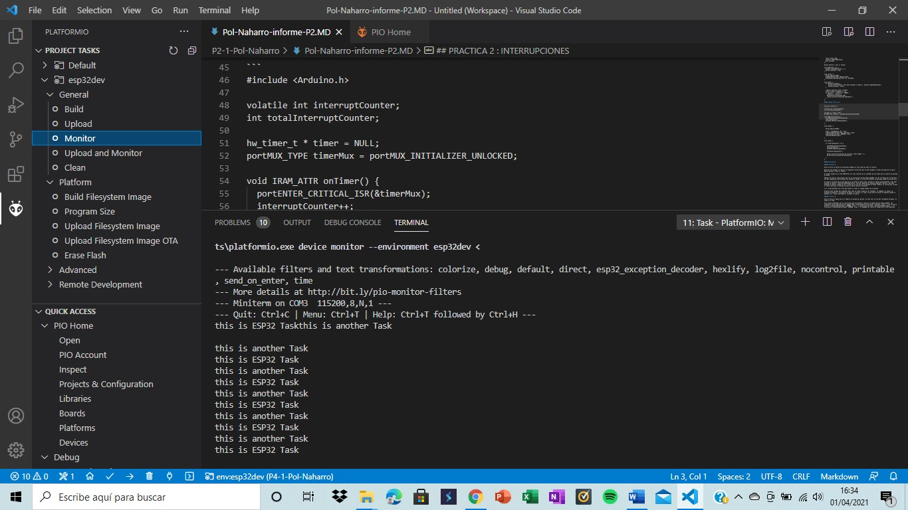

Pol Naharro
## PRACTICA 4 : SISTEMAS OPERATIVOS EN TIEMPO REAL


```
#include <Arduino.h>

void anotherTask( void * parameter );

void setup()
{
Serial.begin(112500);
/* we create a new task here */
xTaskCreate(
anotherTask, /* Task function. */
"another Task", /* name of task. */
10000, /* Stack size of task */
NULL, /* parameter of the task */
1, /* priority of the task */
NULL); /* Task handle to keep track of created task */
}
 
/* the forever loop() function is invoked by Arduino ESP32 loopTask */
void loop()
{
Serial.println("this is ESP32 Task");
delay(1000);
}
 
/* this function will be invoked when additionalTask was created */
void anotherTask( void * parameter )
{
/* loop forever */
for(;;)
{
Serial.println("this is another Task");
delay(1000);
}
/* delete a task when finish,
this will never happen because this is infinity loop */
vTaskDelete( NULL );
}
```

##### Explicación:

Esta práctica se divide en tres partes. La primera es el setup que, como siempre, comienza con el Serial.begin(112500); para permitirnos verlo por el monitor. Después se crea una tasca, con sus respectivos parámetros marcados por los que son en el código. Esta parte llama la función que queremos ejecutar.

La siguiente parte es el loop que saca por pantalla "this is ESP32 Task" con la instrucción Serial.println("this is ESP32 Task"); y después tiene un retardo de 1000 para dejar a la siguiente tasca actuar.

El último apartado es void anotherTask( void * parameter ), que es la función que queremos hacer, que es llamada por la tarea del setup. Esta función crea un bucle infinito como en el loop donde se saca por pantalla "this is another Task" gracias a la instrucción Serial.println("this is another Task"); y, a continuación, el delay para dejar actuar a otra tasca. También tiene vTaskDelete( NULL ); pero no actuará al ser un bucle infinito.

En resumen podemos decir que esta práctica saca por pantalla dos textos de manera intercalada e infinita, gracias a los delays y los bucles infinitos utilizados.


##### Funcionamiento de la práctica:

Comprobación de la pantalla:

